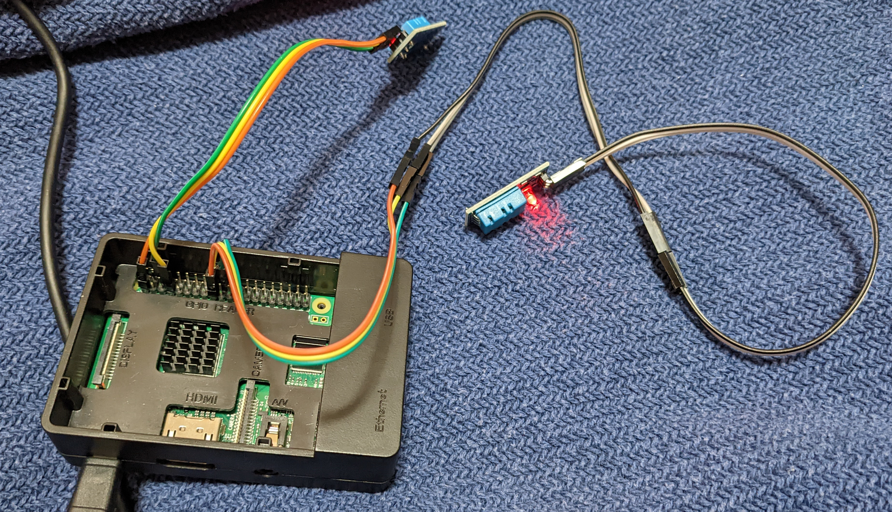
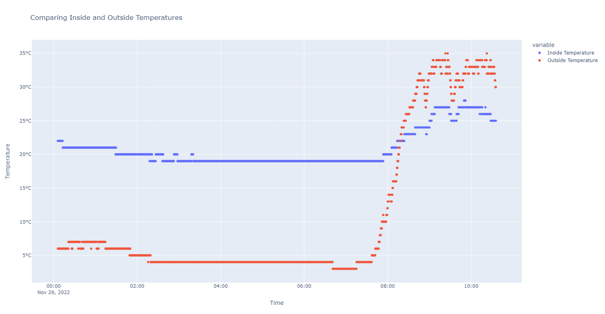
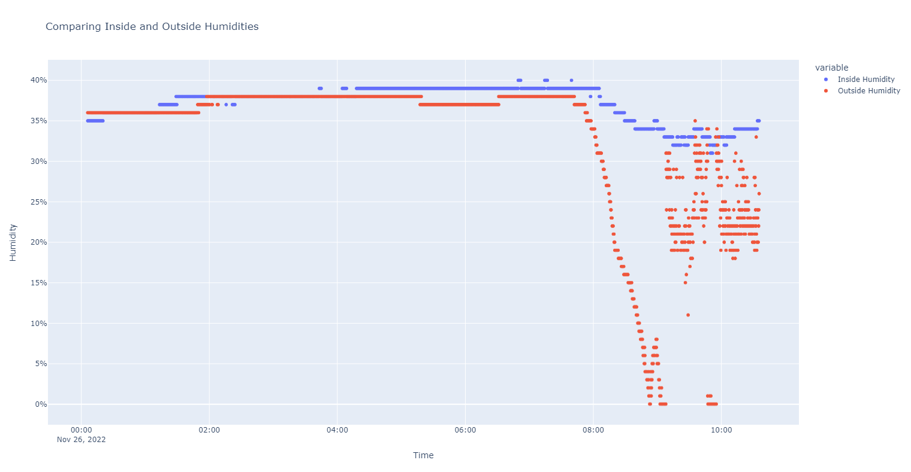

# Weather Monitoring Embedded Python

This project tracks indoor and outdoor temperature and humidity, alerting the user when it's best to open or close the window for optimal indoor temperature and humidity conditions. 
The Raspberry Pi is setup inside a window, with the outside sensor being placed through a gap in the sealing strip.

## Overview

- **Goal**: Achieve optimal indoor humidity (40%-50%) and temperature (20°C - 25.5°C) 
- **Hardware**: Raspberry Pi 3B+, Two DHT11 Temperature and Humidity Sensors, Wires, A 3.5A USB power adapter, and a second computer
- **Sensor Specifications**: 20-90% Relative Humidity with ±5% accuracy, 0-50°C temperature with ±2°C accuracy
- **Setup**: Run python files on a computer and the Raspberry Pi, position one sensor inside and the other outside the window
- **Software**: Raspberry Pi OS, Python language, `Adafruit_DHT` Python module
- **Operation**: Take temperature and humidity readings, average them, determine if the window should be opened or closed, and then send an appropriate alert message to the user

## Usage

1. `server.py`: Sets up a server that receives messages from the window sensors
2. `window_sensors.py`: Interacts with the DHT11 sensors, processes data, determines appropriate conditions, and sends an alert message to the server

Use the command `python server.py` to start the server, and `python window_sensors.py ip_address` to start the window sensor script. Additional arguments for window_sensors.py can be found by running `window_sensors.py --help`

## Charts

Below are two charts showing typical logged data from the indoor and outdoor sensors.

### Temperature 

### Humidity

